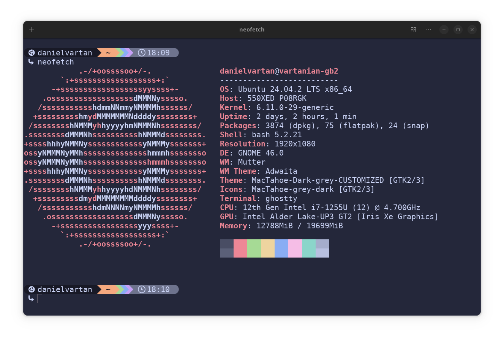

# starship

<!-- badges: start -->

<!-- badges: end -->

## Overview

My [Starship](https://starship.rs/) theme. 🛸

Designed for use with [Ghostty](https://github.com/danielvartan/ghostty). 👻

## Inspirations

- [Catppuccin](https://catppuccin.com/)
- [Rosé Pine Starship Theme](https://github.com/rose-pine/starship)
- [Starship's Gruvbox Rainbow Preset](https://starship.rs/presets/gruvbox-rainbow)

## Installation

1. Copy `starship.toml` to `$HOME/.config`.

That's it!
